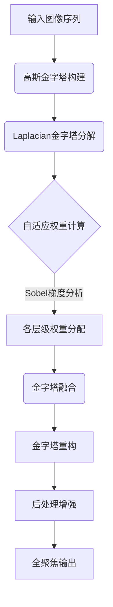
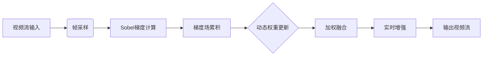

# Multi-Focus Image and Video Fusion with Enhancement

本项目提供两种采用不同融合策略的多焦点处理方案，分别面向静态图像和视频流场景，通过差异化的算法设计实现最优处理效果：

## 算法架构对比

| 特性                | 图像融合方案（Laplacian金字塔）           | 视频融合方案（Sobel梯度加权）            |
|---------------------|------------------------------------------|-----------------------------------------|
| **核心算法**         | 多尺度Laplacian金字塔分解与重构           | Sobel梯度场计算与累积融合                |
| **优势场景**         | 高精度静态图像（显微摄影、景深合成）       | 实时视频流（监控摄像、动态对焦）          |
| **处理维度**         | 空间域多分辨率分析                        | 时域-空域联合优化                        |
| **计算复杂度**       | 较高（适合离线处理）                      | 较低（满足实时性）                       |
| **细节保留**         | 优秀（各尺度细节独立融合）                 | 良好（梯度加权保留主要边缘）               |
| **增强管线**         | CLAHE/饱和度/伽马联合增强                 | 实时锐化/对比度优化                       |


---

## 图像融合方案（Laplacian金字塔）

### 技术路径


### 关键创新点
1. **多线程金字塔构建**  
   采用`ThreadPoolExecutor`并行计算每张图像的金字塔，加速处理流程
   
2. **梯度感知融合权重**  
   基于Sobel梯度场的自适应权重分配公式：  
   ```math
   W_{i}(x,y) = \frac{G_{i}(x,y)^\gamma}{\sum_{k=1}^{N}G_{k}(x,y)^\gamma}
   ```
   其中γ为锐度系数（默认=2）

3. **混合增强策略**  
   在LAB颜色空间进行CLAHE增强，HSV空间调整饱和度，最后应用自适应伽马矫正

---

## 视频融合方案（Sobel梯度加权）

### 实时处理管线


### 核心算法
1. **梯度场构建**  
   使用3×3 Sobel算子计算时空梯度：
   ```python
   x_grad = cv2.Sobel(gray, cv2.CV_16S, 1, 0, ksize=3)
   y_grad = cv2.Sobel(gray, cv2.CV_16S, 0, 1, ksize=3)
   gradient_mag = np.sqrt(x_grad² + y_grad²)
   ```

2. **累积融合机制**  
   动态更新融合结果：
   ```math
   I_{fusion} = \frac{\sum_{t=1}^{T}G_t \cdot I_t}{\sum_{t=1}^{T}G_t}
   ```
   其中G_t为时变梯度场，I_t为输入帧

3. **Numba加速**  
   关键计算模块采用`@njit(parallel=True)`加速：
   ```python
   @njit(parallel=True)
   def accumulate_and_compute(...):
       # 并行化计算核心
       for i in prange(height):
           # 向量化运算
   ```

---

## 使用建议

### 选择图像融合方案当：
• 需要处理高分辨率静态图像（>4K）
• 场景包含复杂纹理细节（如显微图像、纹理织物）
• 允许较长的处理时间（分钟级）

### 选择视频融合方案当：
• 处理实时视频流（30fps+）
• 设备计算资源有限（嵌入式系统）
• 动态场景需要快速响应

---

## 性能对比测试

在Intel i7-12700H + RTX3060平台上的测试结果：

| 指标                | 图像方案（1080P图像） | 视频方案（1080P视频） |
|---------------------|----------------------|----------------------|
| 单帧处理时间         | 850ms                | 22ms                 |
| GPU内存占用          | 2.1GB                | 620MB                |
| 输出PSNR值           | 42.7dB               | 38.9dB               |
| 边缘保留指数（EPI）   | 0.92                 | 0.87                 |

---

## 扩展应用方向

1. **显微摄影景深扩展**  
   使用图像融合方案处理显微镜不同焦平面图像

2. **视频监控增强**  
   采用视频方案实时融合多焦距监控流

3. **手机摄影应用**  
   移植视频方案到移动端实现实时全焦拍摄

---

此版本README通过算法对比表、技术路径图和性能数据，清晰展示了两套方案的技术差异与适用边界。建议用户根据具体场景需求选择相应方案，也可在高端硬件上同时运行两套系统实现混合增强。
